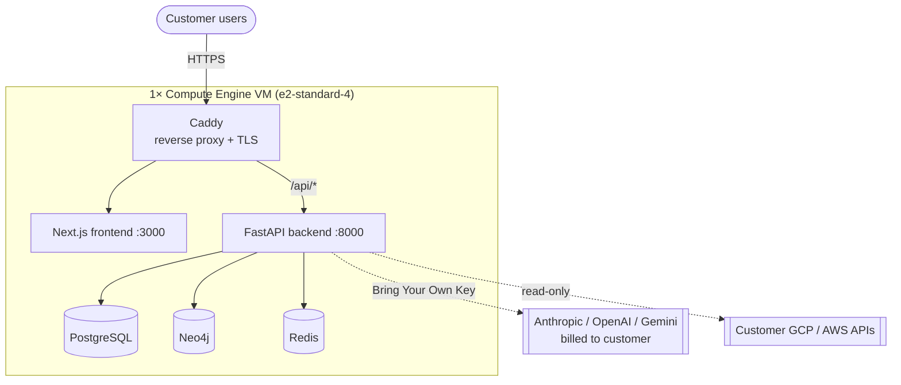
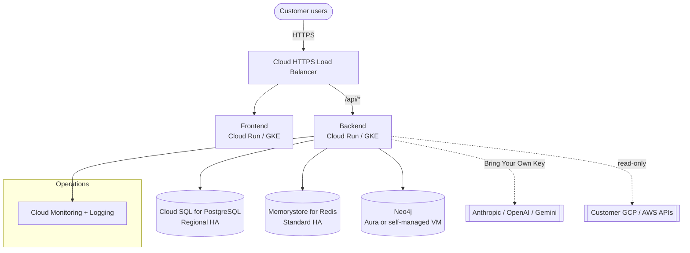

# Intellicore CMP — GCP Architecture & Cost to Operate

> Pricing below uses GCP **list prices** for the **asia-south1 (Mumbai)** region as
> a planning estimate. Verify exact figures with the
> [GCP Pricing Calculator](https://cloud.google.com/products/calculator) before
> committing. LLM/AI usage is **not** a platform cost — customers Bring Their Own
> Key (Settings → AI Keys), so inference is billed to the customer's own
> Anthropic/OpenAI/Google account.

---

## Two deployment topologies

Intellicore CMP ships in two shapes. Every new customer starts on **Topology A**
(cheap, single-VM, isolated) and graduates to **Topology B** (HA managed
services) when their scale or SLA warrants it.

### Topology A — Single-VM (current default, per-customer isolation)

Everything runs as Docker Compose on one VM behind Caddy (auto-TLS via sslip.io).
This is what `deploy-customer.yml` provisions today.

**Characteristics**
- One VM per customer → hard data isolation, simplest billing, easiest to reason about.
- All state (Postgres, Neo4j, Redis) lives on the VM's persistent disks.
- Backups via disk snapshots.
- Suitable for Foundation / Advanced tiers and pilots.

### Topology B — Production HA (managed services)

For Elite-tier / larger customers needing high availability and horizontal scale.

**Characteristics**
- Stateless app tier scales horizontally (Cloud Run or GKE Autopilot).
- Managed Postgres & Redis with automated failover, backups, patching.
- Neo4j on Aura (managed) or a dedicated VM.
- Global HTTPS LB with managed certs + Cloud Armor option.

---

## Component responsibilities

| Component | Role |
|-----------|------|
| **Caddy / Cloud LB** | TLS termination, reverse proxy, edge auth gate (session check) |
| **Next.js frontend** | UI for all 10 pages; talks to backend via `/api/*` |
| **FastAPI backend** | Auth (password + TOTP), Memory graph API, events ingest, settings/BYOK |
| **PostgreSQL** | Users, tenants, sessions, cloud accounts, guardrails, **encrypted AI keys** |
| **Neo4j** | The operational Memory knowledge graph (events, patterns, causal chains) |
| **Redis** | Sessions and caching |
| **BYOK LLM** | Customer's own Anthropic/OpenAI/Gemini key powers all AI features |

---

## Network & security

- **TLS everywhere** — Caddy (Topology A) or Google-managed certs (Topology B).
- **Edge auth gate** — every route requires a valid session (forward-auth to `/auth/session/check`); only the login shell and auth endpoints are public.
- **2FA** — email/password + TOTP (Google Authenticator compatible).
- **Per-tenant isolation** — Topology A: separate VM per customer. Topology B: tenant_id scoping on every query + separate managed instances per customer where required.
- **AI keys encrypted at rest** — `pgp_sym_encrypt` (pgcrypto); only last 4 chars ever returned to the UI.
- **Firewall** — only 80/443 open to the internet; databases never exposed publicly.
- **Least-privilege cloud access** — read-only service accounts to poll customer GCP/AWS.

---

## Cost — Topology A (single-VM, per customer)

Monthly, asia-south1 list prices. This is the recurring cost **per customer**.

| Line item | Spec | On-demand / mo | With 1-yr CUD / mo |
|-----------|------|---------------:|-------------------:|
| Compute Engine VM | e2-standard-4 (4 vCPU, 16 GB) | ~$110 | ~$70 |
| Boot + data disk | 100 GB pd-balanced | ~$11 | ~$11 |
| Static external IP | 1 address, in use | ~$3 | ~$3 |
| Disk snapshots (backup) | ~100 GB, daily retention | ~$6 | ~$6 |
| Network egress | ~50–100 GB/mo | ~$10 | ~$10 |
| Cloud Logging/Monitoring | modest ingest | ~$5 | ~$5 |
| **Total (infrastructure)** | | **~$145/mo** | **~$105/mo** |
| LLM / AI inference | Bring Your Own Key | **$0 to platform** | **$0 to platform** |

**≈ $105–145 / month per customer (~₹9,000–12,500/mo).** Annual: **~$1,300–1,750**.

A lighter **e2-standard-2** (2 vCPU, 8 GB) works for small/pilot tenants and drops
the VM line to ~$55/mo on-demand (~$35 CUD) → **total ~$85–95/mo**.

---

## Cost — Topology B (production HA)

Monthly, asia-south1 list prices, per customer. Ranges reflect HA vs. non-HA choices.

| Line item | Spec | Est. / mo |
|-----------|------|----------:|
| App tier (frontend + backend) | Cloud Run (min instances) or GKE Autopilot | $80 – $160 |
| Cloud SQL for PostgreSQL | db-custom-2-8, regional HA + storage | $250 – $350 |
| Memorystore for Redis | Standard HA, 1–2 GB | $50 – $80 |
| Neo4j | Aura Professional **or** e2-standard-2 self-managed | $55 – $130 |
| Cloud HTTPS Load Balancer | forwarding rules + static IP | $20 – $25 |
| Network egress | 100–300 GB/mo | $15 – $40 |
| Cloud Logging/Monitoring | higher ingest | $20 – $40 |
| Backups / snapshots | automated | $15 – $25 |
| **Total (infrastructure)** | | **~$505 – $850/mo** |
| LLM / AI inference | Bring Your Own Key | **$0 to platform** |

**≈ $505–850 / month per customer (~₹43,000–73,000/mo).** Annual: **~$6,000–10,200**.
Committed-use / sustained-use discounts on Cloud SQL and compute can cut 20–37%.

---

## Per-customer economics (Topology A)

Because each customer is one isolated VM, cost scales close to linearly:

| Customers | Infra / mo (on-demand) | Infra / mo (CUD) | Annual (CUD) |
|----------:|-----------------------:|-----------------:|-------------:|
| 1 | ~$145 | ~$105 | ~$1,260 |
| 5 | ~$725 | ~$525 | ~$6,300 |
| 10 | ~$1,450 | ~$1,050 | ~$12,600 |
| 25 | ~$3,625 | ~$2,625 | ~$31,500 |

Shared platform overhead (CI/CD runners, a management project, artifact registry,
DNS) adds a flat **~$20–50/mo** regardless of customer count.

> AI inference never appears in these tables — it is always the customer's own
> spend on their own key.

---

## Recommendations

1. **Default new customers to Topology A** via the `deploy-customer.yml` pipeline.
   It's cheap (~$105–145/mo), fully isolated, and provisions in minutes.
2. **Buy 1-year committed-use discounts** on steady-state VMs to save ~35%.
3. **Right-size**: pilots and small tenants on `e2-standard-2`; standard on
   `e2-standard-4`; only move to Topology B when HA/scale is contractually required.
4. **Graduate to Topology B** per customer, not globally — keep the cheap default.
5. **Keep BYOK** — it removes the platform's largest variable cost (LLM tokens)
   and lets customers control their own AI spend and data-processing agreements.
